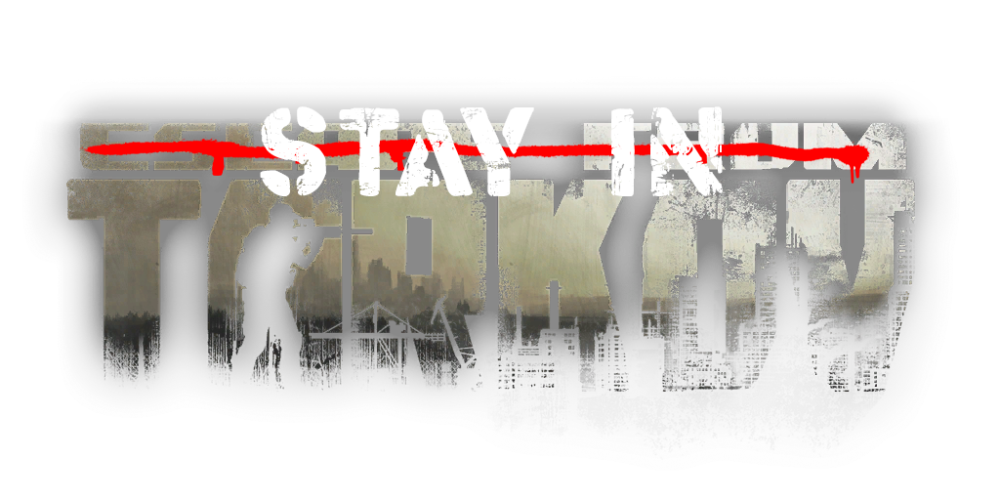

<!-- PROJECT LOGO -->
 

  

  [![Contributors][contributors-shield]][contributors-url]
  [![Forks][forks-shield]][forks-url]
  [![Stargazers][stars-shield]][stars-url]
   
  ![TotalDownloads][downloads-total-shield]
  ![LatestDownloads][downloads-latest-shield]

<h3 align="center">Stay In Tarkov Client</h3>

  

    此 BepInEx 模组适用于逃离塔科夫, 与 SIT.Aki-Server-Mod 一同使用, 以在"离线模式"内进行联机
     
    <a href="https://docs.stayintarkov.com/zh_CN/index.html"><strong>浏览文档 »</strong></a>
  

  [English](README.md) **|** [简体中文](README_CN.md) **|** [Deutsch](README_DE.md) **|** [Português-Brasil](README_PO.md) **|** [日本語](README_JA.md) **|** [한국어-Korean](README_KO.md) **|** [Français](README_FR.md)

<!-- TABLE OF CONTENTS -->

  
目录

  <ol>
    <li><a href="#%E5%85%B3%E4%BA%8E">关于</a></li>
    <li><a href="#%E5%85%A5%E9%97%A8">入门</a></li>
    <li><a href="#%E6%9C%AA%E6%9D%A5%E8%A7%84%E5%88%92">未来规划</a></li>
    <li><a href="#%E8%81%94%E7%B3%BB%E6%88%91%E4%BB%AC">联系我们</a></li>
    <li><a href="#%E4%BB%A3%E7%A0%81%E8%B4%A1%E7%8C%AE">代码贡献</a></li>
    <li><a href="#%E8%AE%B8%E5%8F%AF%E8%AF%81">许可证</a></li>
    <li><a href="#%E7%89%B9%E5%88%AB%E8%87%B4%E8%B0%A2">特别致谢</a></li>
  </ol>

<!-- ABOUT THE PROJECT -->
## 关于

Stay In Tarkov (SIT) 是逃离塔科夫的一个模组, 设计目的为实现联机合作.

SIT 项目目前由一个小型的开发团队进行共同开发. 虽然本项目当前处于可用状态, 但在游玩过程中, 仍然会出现一些 BUG 或是性能问题. 逃离塔科夫与 SPT-Aki 的更新较为频繁, 您的离线版帐号也会随着更新的到来, 必须进行重置.

换言之, SIT 无法完美替代您在官方 PvE 模式的体验: 请留意, 您可能会遇见严重影响体验的 BUG, 并且您无法自行解决.

<!-- GETTING STARTED -->
## 入门

有关架设 SIT 的所有信息均可在[我们的文档](https://docs.stayintarkov.com/zh_CN/index.html)中进行查询

在您尝试加入 Discord 群组并进行发问前, 请务必阅读一下文档的内容, 因为文档中很可能就包含您正在寻找的答案!

<!-- ROADMAP -->
## 未来规划

关于未来规划, 您可以[点击这里](https://docs.stayintarkov.com/zh_CN/plans.html)查看

<!-- CONTACT -->
## 联系我们

您可以加入我们的 Discord 群组: [stayintarkov.com/discord](https://stayintarkov.com/discord)

<!-- CONTRIBUTING -->
## 代码贡献

* 我们鼓励并深切感谢任何合并请求. 感谢所有贡献者的付出!

* 贡献时请注意, 我们不接受使用 GClass* 类. 如果您的代码存在任何 GClass* 类, 且是必须使用的代码, 您需要在合并请求中注明并标注使用原因, 我们会将其重映射为合适的名称.

<!-- LICENSE -->
## 许可证

* 几乎所有的单人游戏与其核心代码为 SPT-Aki 项目组编写. 本项目使用与其相同的开源许可: NCSA 开源许可证

* Paulov 所编写的代码没有任何许可证. 但是, 您不可在未经允许的情况下进行挪用或进行商业行为. 在使用 Paulov 的代码时, 您需要在代码中注明作者.

* SIT 项目组所编写的代码为 MIT 许可证.

* [RevenantX LiteNetLib](https://github.com/RevenantX/LiteNetLib) 为 MIT 许可证.

* [DrakiaXYZ](https://github.com/DrakiaXYZ/) 的项目包含 MIT 许可证 (自 1.10 版本开始, DrakiaXYZ 的项目已不再内置于本项目)

<!-- ACKNOWLEDGMENTS -->
## 特别致谢

* [Paulov](https://github.com/paulov-t) | [Ko-Fi 打赏](https://ko-fi.com/paulovt) (Stay in Tarkov 的原作者)
* [Mihai](https://github.com/mihaicm93) | [Ko-Fi 打赏](https://ko-fi.com/mmihai)
* [Trippy](https://github.com/trippyone)
* [Bullet](https://github.com/devbence) | [Ko-Fi 打赏](https://ko-fi.com/bullet4prz)
* [Dounai](https://github.com/dounai2333)
* [SPT-Aki 项目组](https://www.sp-tarkov.com/) (每一个所使用的 Aki 代码均保留了 Aki 的注释信息, 非常感谢每位开发者的支持)
* [DrakiaXYZ](https://github.com/DrakiaXYZ/)
* [所有贡献者们](https://github.com/stayintarkov/StayInTarkov.Client/graphs/contributors)与所有曾经为 SIT.Core 做出过贡献的贡献者
* [RevenantX LiteNetLib](https://github.com/RevenantX/LiteNetLib)

<!-- MARKDOWN LINKS & IMAGES -->
[contributors-shield]: https://img.shields.io/github/contributors/stayintarkov/StayInTarkov.Client.svg?style=for-the-badge

[contributors-url]: https://github.com/stayintarkov/StayInTarkov.Client/graphs/contributors

[forks-shield]: https://img.shields.io/github/forks/stayintarkov/StayInTarkov.Client.svg?style=for-the-badge&color=%234c1

[forks-url]: https://github.com/stayintarkov/StayInTarkov.Client/network/members

[stars-shield]: https://img.shields.io/github/stars/stayintarkov/StayInTarkov.Client?style=for-the-badge&color=%234c1

[stars-url]: https://github.com/stayintarkov/StayInTarkov.Client/stargazers

[downloads-total-shield]: https://img.shields.io/github/downloads/stayintarkov/StayInTarkov.Client/total?style=for-the-badge

[downloads-latest-shield]: https://img.shields.io/github/downloads/stayintarkov/StayInTarkov.Client/latest/total?style=for-the-badge
