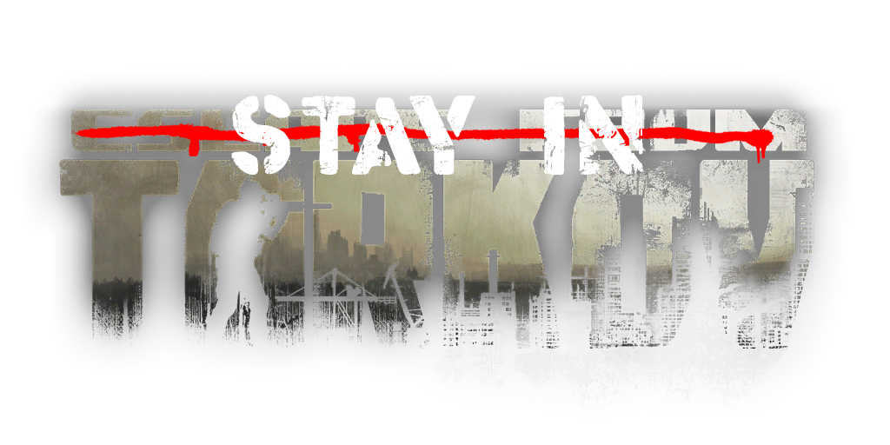

<!-- PROJECT LOGO -->
 

  

  [![Contributors][contributors-shield]][contributors-url]
  [![Forks][forks-shield]][forks-url]
  [![Stargazers][stars-shield]][stars-url]
   
  ![TotalDownloads][downloads-total-shield]
  ![LatestDownloads][downloads-latest-shield]

<h3 align="center">Stay In Tarkov Client</h3>

  

    SIT.Aki-Server-Modを使用した「オフライン」協力プレイを目標とするEscape From TarkovのBepInExモジュール
     
    <a href="https://stayintarkov.com/docs"><strong>ドキュメントへ »</strong></a>
  

  [English](README.md) **|** [简体中文](README_CN.md) **|** [日本語](README_JA.md)

<!-- TABLE OF CONTENTS -->

  
目次

  <ol>
    <li>
      <a href="#about-the-project">このプロジェクトについて</a>
    </li>
    <li>
      <a href="#getting-started">はじめに</a>
    </li>
    <li><a href="#contact">連絡先</a></li>
    <li><a href="#roadmap">ロードマップ</a></li>
    <li><a href="#contributing">コントリビュート</a></li>
    <li><a href="#acknowledgments">クレジット</a></li>
    <li><a href="#license">ライセンス</a></li>
  </ol>

<!-- ABOUT THE PROJECT -->
## About The Project

Stay In Tarkov (SIT) はEscape From Tarkovの協力プレイMODです。

Stay In Tarkovは少ないチーム員開発者によって作られています。SITがプレイできる限りはバグとプレイヤー間のシンクと性能の問題などが発生することもあります。 Escape From TarkovとSPT-AKI更新の頻度が多くなってしまったらあなたの進行（プロフィール）がリセットされる可能性があります。

あと、SITは完璧ではないライブでの経験を提供することには難しいことをいつもお分かりいただきたいと思います。

<!-- GETTING STARTED -->
## はじめに

全てのSITセットアップのマニュアルは[こっち](https://stayintarkov.com/docs)のドキュメントを参考してください。

先にこのページを読むことにしてDiscordの質問チャンネルで可能であればドキュメントにも記載されている問題については質問を避けてください。

<!-- ROADMAP -->
## ロードマップ
開発ロードマップは[こっち](https://docs.stayintarkov.com/en/plans.html)をクリックしてください。

<!-- CONTACT -->
## 連絡/サポート

連絡を最も取りやすいところはSITのDiscord先です。\
こっちらは私たちのDiscord招待URLです > https://stayintarkov.com/discord

<!-- CONTRIBUTING -->
## コントリビュート

* 草生やし(コントリビュート)はいつでも歓迎です！

* GCLASSXXXのコードについては制限的であることでコード作成にも制限が与えられます。コントリビュートすることに必要がある場合はプールリクエスト先にそのGCLASSのリストを作成してから少しお待ちしてください。

<!-- LICENSE -->
## License

* 99%の機能はSPT-Akiチームにより立てられています。このソースと共にライセンスが存在します。

* [RevenantX LiteNetLib](https://github.com/RevenantX/LiteNetLib) MITライセンス

* [DrakiaXYZ](https://github.com/DrakiaXYZ/)のプロジェクトにはMITライセンスが含まれていましたが、1.10以降はDrakiaのプロジェクトが含まれていません

<!-- ACKNOWLEDGMENTS -->
## クレジット & 感謝

* [Paulov](https://github.com/paulov-t) (Stay in Tarkovを組み上げたオリジナル開発者)
* [Mihai](https://github.com/mihaicm93) | [Ko-Fi Ko-Fi サポート](https://ko-fi.com/mmihai)
* [Trippy](https://github.com/trippyone)
* [Lacyway](https://github.com/lacyway)
* [Bullet](https://github.com/devbence) | [Ko-Fi Donations](https://ko-fi.com/bullet4prz)
* [Dounai](https://github.com/dounai2333)
* [SPT-Aki チーム](https://www.sp-tarkov.com/) (使用した一つ一つのコードファイルと開発担当の人への多くの感謝クレジット)
* [DrakiaXYZ](https://github.com/DrakiaXYZ/)
* [コントリビューター](https://github.com/stayintarkov/StayInTarkov.Client/graphs/contributors)と以前のSIT.Coreのコントリビューター
* [RevenantX LiteNetLib](https://github.com/RevenantX/LiteNetLib)

<!-- MARKDOWN LINKS & IMAGES -->
[contributors-shield]: https://img.shields.io/github/contributors/stayintarkov/StayInTarkov.Client.svg?style=for-the-badge

[contributors-url]: https://github.com/stayintarkov/StayInTarkov.Client/graphs/contributors

[forks-shield]: https://img.shields.io/github/forks/stayintarkov/StayInTarkov.Client.svg?style=for-the-badge&color=%234c1

[forks-url]: https://github.com/stayintarkov/StayInTarkov.Client/network/members

[stars-shield]: https://img.shields.io/github/stars/stayintarkov/StayInTarkov.Client?style=for-the-badge&color=%234c1

[stars-url]: https://github.com/stayintarkov/StayInTarkov.Client/stargazers

[downloads-total-shield]: https://img.shields.io/github/downloads/stayintarkov/StayInTarkov.Client/total?style=for-the-badge

[downloads-latest-shield]: https://img.shields.io/github/downloads/stayintarkov/StayInTarkov.Client/latest/total?style=for-the-badge
